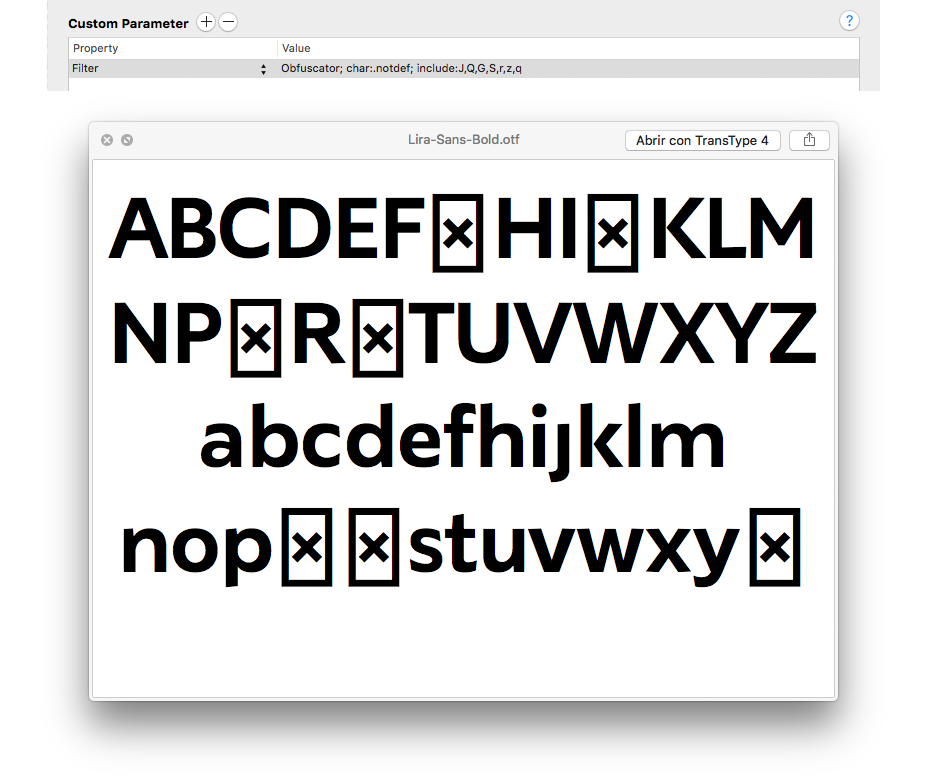

Obfuscator
==============
This Glyphs app filter replaces glyphs for another one in the font. Useful for replace glyphs in demo version of a font.

### How to use:
Use it as a custom paramenter in an instance or in a .glyphsproject file.

```
Property: Filter 
Value: Obfuscator; char:.notdef; include:A,B,C;
```

After `char:` you can define the glyph name you want to use as a replacement. If `char:` is not declared it will use the `apple` character.
`include:` is what glyphs you want to replace. Also, instead of `include:` you can use `exclude:` to apply the filter to all the glyphs in the font excepting the listeds. 

If it is used via the menu **Filter>Obfuscator** it will replace the selected glyphs for the `apple` character.

### Installation:
Download the plugin, open it and restart glyphs.
For better update handling install the script via the **Window > Plugin Manager** inside Glyphs App.

### Donate:
If this plugin is helpful for you, maybe you can consider making a donation ;)

[](https://www.paypal.com/cgi-bin/webscr?cmd=_donations&business=NXQFEWCXXJABE&lc=US&item_name=Github%20Donate&currency_code=USD&bn=PP%2dDonationsBF%3abtn_donate_LG%2egif%3aNonHosted)



